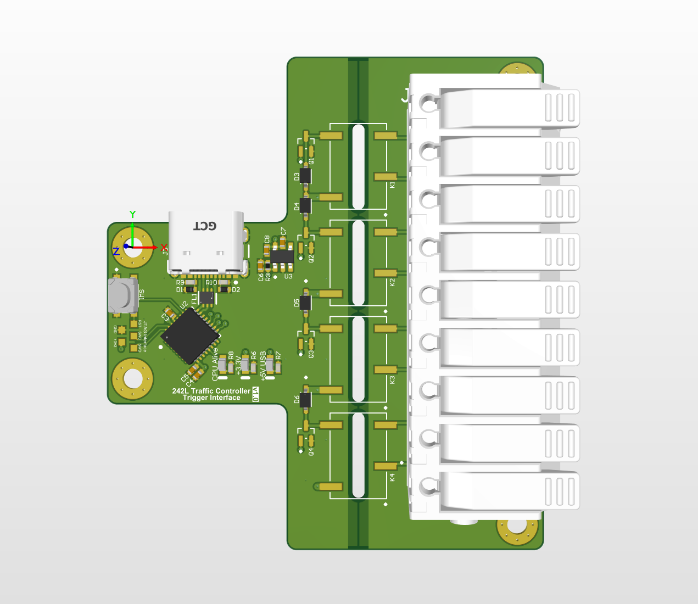

# Vision-Integrated Signal Cabinet Controller | SAMD21 24V Traffic Interconnect


An industrial hardware bridge interfacing edge computer vision point-cloud object detection models with CALTRANS-compliant 24V DC intersection signal controllers. Powered by an extended-temperature SAMD21 32-bit ARM Cortex-M0+ MCU, the board translates real-time inference commands into galvanically isolated 24V signal toggles using custom zero-allocation C++ dual state machines and power-of-two ring buffer memory architectures.

---

## 📷 System Architecture & PCB Render



---

## 🛠 Engineering Highlights & System Architecture

* **Galvanically Isolated 24V Industrial I/O:** Bridges 3.3V MCU logic to high-voltage CALTRANS intersection cabinets via 4 channels of low-power signal relays, preventing high-voltage transients from affecting inference hardware.
* **Dual non-blocking C++ State Machines:** Decouples serial command parsing from physical GPIO actuation. A Serial SM processes incoming ASCII inference streams while a deterministic Channel Driver SM handles timing and relay state execution.
* **Zero-Allocation Ring Buffer Architecture:** Encapsulates channel state in a `ChannelManager` class using power-of-two ring buffers ($2^n$). Leverages bitwise bitmask operations (`index & (SIZE - 1)`) instead of modulo operations to guarantee zero-latency buffer bounds enforcement.
* **Atomic Bit-Field State Tracking & Re-trigger Handling:** Uses an 8-bit `ticket` status variable split into Request (lower 4 bits) and Active (upper 4 bits) flags. Re-trigger spam from edge vision models automatically resets activation timers without dropping relay state, returning real-time ASCII telemetry back to the vision node.
* **Extended Thermal Rating:** Fully populated with industrial/extended-temperature-rated ICs and relays (-40°C to +85°C) engineered for unconditioned roadside cabinet environments.
---

## 📐 System Technical Specifications

| Parameter | Specification Details |
| :--- | :--- |
| **Microcontroller** | Microchip/Atmel SAMD21E18 (Industrial Extended-Temp Rating) |
| **Cabinet Interface Voltage** | 24V DC Digital Logic (CALTRANS TEES Interconnect Standard) |
| **Relay Isolation Stage** | 4-Channel Galvanic Signal Relays (Optically / Electromechanically Isolated) |
| **Host Communication** | USB 2.0 CDC Virtual COM (ASCII Command/Telemetry Protocol) |
| **Memory Management** | Fixed Allocation $2^n$ Static Ring Buffer with Bitwise Masking |
| **State Synchronization** | Atomic 8-Bit Ticket State Variable (Upper 4: Active / Lower 4: Requested) |
| **Operating Environment** | Extended Industrial Temperature Range (-40°C to +85°C) |

---

## 🔬 Validation, Testing & Debugging

* **Industrial Transient Protection:** Validated galvanic isolation boundary across 24V switching loads to ensure zero ground loops or inductive feedback into the SAMD21 host MCU.
* **Relay Re-triggering Logic Verification:** Tested edge-case serial input spamming from the CV host; confirmed that active channels safely reset `time_activated` without output chatter or state desynchronization.
* **Real-Time ASCII Telemetry Benchmarking:** Measured low-latency serial parsing loops and confirmed deterministic timing under max baud-rate synthetic vision detection bursts.

---

## ⚙️ Software Architecture & Dynamic State Flow

```text
[ CV Point-Cloud Model ] 
       │ (ASCII Commands over USB Serial)
       ▼
┌─────────────────────────────────────────────────────────┐
│  Serial State Machine                                   │
│  - Parses incoming serial buffer                        │
│  - Sets Request Bits in 8-bit Ticket Register           │
│  - Emits telemetry & channel reset warnings             │
└────────────────────────────┬────────────────────────────┘
                             │ Writes to
                             ▼
┌─────────────────────────────────────────────────────────┐
│  ChannelManager (Ring Buffer)                           │
│  - Holds Channel structs (ID, Time Activated, Duration) │
│  - Evaluated using bitwise masking ops (& MASK)         │
└────────────────────────────┬────────────────────────────┘
                             │ Reads from
                             ▼
┌─────────────────────────────────────────────────────────┐
│  GPIO Channel Driver State Machine                      │
│  - Sets Active Bits in upper half of Ticket Register    │
│  - Drives Galvanically Isolated 24V Signal Relays       │
└────────────────────────────┬────────────────────────────┘
                             │ Toggles
                             ▼
[ Caltrans 24V DC Intersection Cabinet ]
```

---

## 💻 Firmware Architecture & Flashing

The firmware utilizes a custom PlatformIO board variant forked from the `Adafruit Arduino SAMD Core` to map the custom PCB pin configuration correctly.

```bash
# Clone the repository
git clone https://github.com/DiamondFire11/Traffic-Signal-Interconnect.git
cd Cabinet-Signal-Interface

# Build firmware target via PlatformIO
pio run -e samd21_cabinet_interface
```

---

## ⚡ Flashing via SWD & Hardware Debugging
1. Connect an Atmel-ICE or SWD-compatible programmer to the target SWD header pads.
2. Flash the board configuration using PlatformIO or Atmel Studio.
3. **Recovery Mode**: If USB SERCOM arbitration triggers a bus fault during firmware execution, double-tap the physical reset pad to force hardware bootloader mode.

--- 

## 📄 License & Hardware Manufacturing Files
* **Production Files**: Production Gerber (.gbr), N.C. Drill (.drl), Solder Paste Stencils (.gtp/.gbp), and Altium Draftsman assembly drawings are located in the /hardware directory
* **License**: Distributed under [GPLv3 License](https://github.com/DiamondFire11/Tartarus-Joystick-Mod/blob/main/LICENSE).